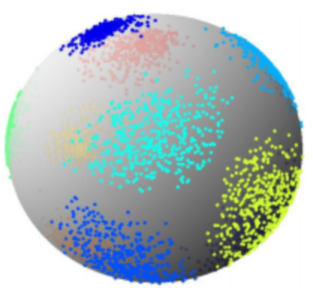
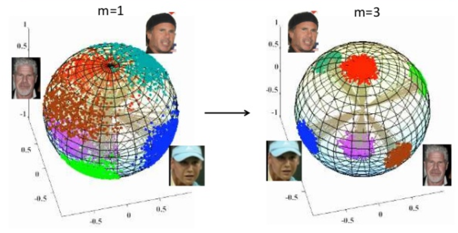
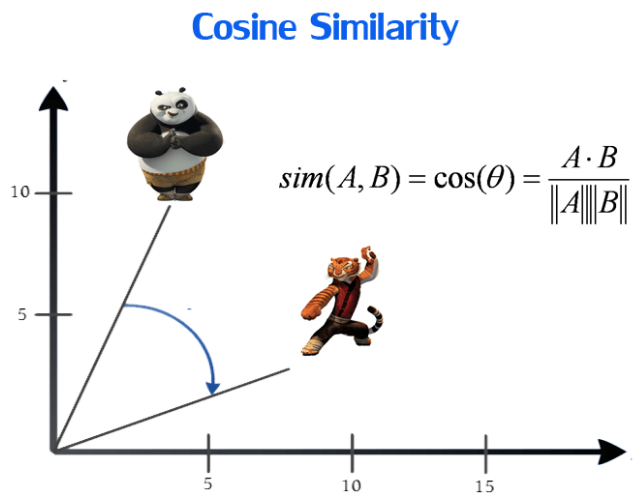
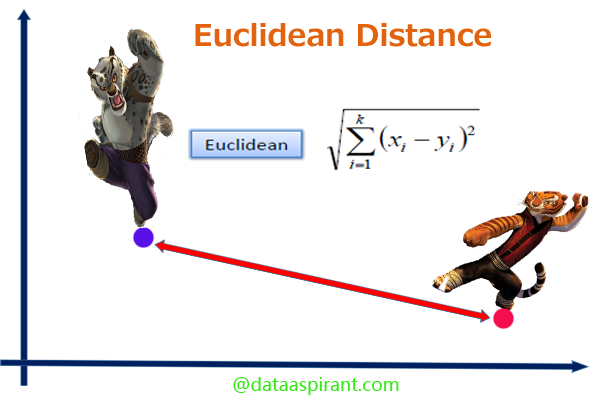

# Face_Recognition : 

- Face_Recognition project with Python and C

- This is the Face_Recognition project for the begineer, if you just start an project in this field, Welcome to join me and explored the interested here together.
 

## 1.What is & Why Face-Recognition ?

- Face-Recognition is the technology for extract the individual-face-information, transforming into the high dimension vector.
And then, you can divide different people's face with those individual high-dimension vector,  

- Here some example showing how does it work :

 1. The sphere below showing how's the face-information in high-dimension vector ,
 2. Every spot mean different image, if the image is the same person's face, the spot should be closer. 

 
 

   Here show some different skill in softmax, obviously the right one(AM-Softmax) having the greatest result. 
 
 
 more imformation about AM-Softmax : https://towardsdatascience.com/additive-margin-softmax-loss-am-softmax-912e11ce1c6b

## 2.How specific showing Face-Recognition in the real world ?

- Here is the example of my own image compare with others people, and you'll discover some important index, like : 

### A.The Cosine-Similarity / Euclidian Similarity : 

- Use Cosine-Similarity / Euclidian-Similarity to Digitizing the distance between two different face.

 
 

### B.Threshold - Setting : 

- Setting threshold For divide deifferent face.  
- Predict those two-people face the same or not by threshold.

- Visualize the thersholde swtting value in the code and the result judge output 

## 3.Other Interested Application 5, 68 landmarks : 

### The application of 5 & 68 landmarks for grab the location to the face

- Show the output of 5-Landmarks
 

- Show the output of 68-Landmarks :
 
